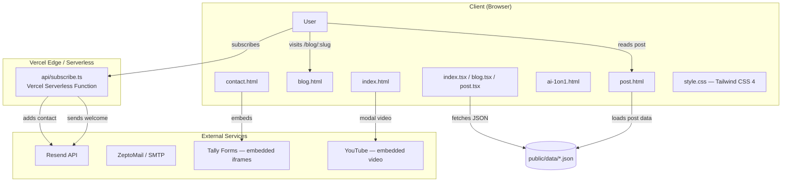

# Adusingi Portfolio — Architecture

> **Project:** Personal portfolio website for Aimable Dusingizimana (Adusingi) — Project Manager & Builder based in Okayama, Japan.  
> **Repository:** https://github.com/adusingi/adusingi-web.git  
> **Last Updated:** 2026-06-11

---

## 1. PROJECT STRUCTURE

```
adusingi-web/
├── index.html                  # Landing page (Home)
├── index.tsx                   # Home page JS entry (menu, scroll, reveal, video modal)
├── blog.html                   # Blog index / listing page
├── blog.tsx                    # Blog index JS entry (pagination, tag filtering)
├── post.html                   # Individual blog post page
├── post.tsx                    # Post page JS entry (dynamic post loading, SEO meta)
├── contact.html                # Contact page with Tally form embeds
├── contact.tsx                 # Contact page JS entry (form toggle, hash routing)
├── ai-1on1.html                # AI 1-on-1 service page
├── ai-1on1.tsx                 # AI 1on1 page JS entry
├── style.css                   # Tailwind CSS 4 + custom reveal animations
├── vite.config.ts              # Vite build configuration (multi-page input)
├── vercel.json                 # Vercel deployment config + URL rewrites
├── tsconfig.json               # TypeScript compiler configuration
├── vitest.config.ts            # Vitest test runner configuration
├── eslint.config.js            # ESLint flat config (TypeScript + browser globals)
├── postcss.config.js           # PostCSS config (Tailwind + autoprefixer)
├── tailwind.config.js          # Tailwind CSS v3 compatibility config (fonts, colors)
├── metadata.json               # Project metadata for AI assistants
├── package.json                # pnpm dependencies & scripts
├── .env.example                # Environment variable template
│
├── src/
│   ├── components/
│   │   └── newsletter-form.ts  # Client-side newsletter subscription form handler
│   ├── lib/
│   │   ├── ui.ts               # Mobile menu & YouTube video modal setup
│   │   └── utils.ts            # Date formatting, email validation, slug extraction
│   └── data/
│       └── posts.json          # Generated blog data (build artifact, backward compat)
│
├── posts/                      # Source Markdown blog posts (YYYY-MM-DD-slug.md)
│   ├── 2017-10-15-*.md
│   ├── 2022-06-15-*.md
│   ├── 2023-01-15-*.md
│   ├── 2023-02-13-*.md
│   ├── 2023-03-10-*.md
│   ├── 2024-12-01-*.md
│   ├── 2024-12-10-*.md
│   ├── 2024-12-15-*.md
│   ├── 2025-12-20-*.md
│   ├── 2026-01-06-*.md
│   └── 2026-01-14-*.md
│
├── scripts/
│   └── build-posts.ts          # Build-time markdown → JSON processor
├── scripts-js/
│   ├── send-newsletter.js      # Standalone ZeptoMail newsletter sender
│   └── test-zeptomail.js       # ZeptoMail SMTP test script
│
├── newsletter/
│   ├── post-template.ts        # HTML email template generator for blog posts
│   └── send-post.ts            # CLI script: send a blog post as newsletter via Resend
│
├── api/
│   └── subscribe.ts            # Vercel Serverless Function: newsletter subscription + welcome email
│
├── public/
│   ├── data/
│   │   ├── posts.json          # Paginated page 1 summaries (generated)
│   │   ├── posts-page-2.json   # Paginated page 2 summaries (generated)
│   │   ├── posts-all.json      # All post summaries for client-side tag filtering (generated)
│   │   └── posts/              # Individual post JSON files (generated)
│   │       └── *.json
│   └── og-image.jpeg           # Open Graph default image
│
├── tests/                      # Comprehensive test suite (Vitest + jsdom)
│   ├── setup.ts                # Global test setup
│   ├── smoke.test.ts           # Infrastructure validation
│   ├── utils.test.ts           # Unit tests for utility functions
│   ├── mobile-menu.test.ts     # Mobile menu component tests
│   ├── newsletter-form.test.ts # Newsletter form component tests
│   ├── api-integration.test.ts # API endpoint integration tests
│   ├── build-posts.test.ts     # Build script integration tests
│   ├── blog-pagination.test.ts # Blog pagination logic tests
│   ├── post-rendering.test.ts  # Post rendering logic tests
│   └── e2e-smoke.test.ts       # End-to-end smoke tests
│
├── docs/                       # Project documentation
│   ├── HANDOVER.md             # Quick project handover guide
│   ├── README.md               # Internal docs index
│   ├── testing-strategy.md     # Testing strategy & coverage report
│   ├── blog-workflow.md        # Blog authoring workflow
│   ├── NEWSLETTER_GUIDE.md     # Newsletter setup & usage guide
│   ├── NEWSLETTER_IMPLEMENTATION.md # Newsletter technical implementation
│   ├── audit-report-2025-12-16-14-28.md # Security audit findings
│   └── *.webp                  # Documentation images
│
└── .github/
    └── workflows/
        └── test.yml              # GitHub Actions CI: lint, type-check, test, build, security audit
```

---

## 2. HIGH-LEVEL SYSTEM DIAGRAM



**Request / Data Flow:**
1. **Static pages** are served from Vercel's CDN (`dist/` output).
2. **Blog posts** are authored in Markdown, then compiled at build time into JSON files in `public/data/`.
3. **Client-side JS** fetches post data dynamically (`fetch('/data/posts.json')`) for blog listing and individual post rendering.
4. **Newsletter subscriptions** hit the Vercel Serverless Function at `/api/subscribe`, which adds contacts to Resend and sends a welcome email.
5. **Newsletter sends** are triggered manually via CLI scripts (`newsletter/send-post.ts` or `scripts-js/send-newsletter.js`) that call Resend or ZeptoMail APIs.

---

## 3. CORE COMPONENTS

### 3.1 Frontend (Static Multi-Page Site)
- **Purpose:** Portfolio showcase, blog reader, contact gateway, newsletter signup
- **Technologies:** Vanilla TypeScript (no framework), Vite (bundler + dev server), Tailwind CSS 4, Lucide Icons (tree-shaken SVG icons)
- **Entry Points:**
  - `index.tsx` — Home page (mobile menu, navbar scroll effect, reveal animations, YouTube video modal)
  - `blog.tsx` — Blog index (pagination, tag filtering, newsletter form)
  - `post.tsx` — Post detail (dynamic slug resolution, meta tag injection, post content rendering)
  - `contact.tsx` — Contact page (hash-based form toggling, Tally embed orchestration)
  - `ai-1on1.tsx` — AI 1-on-1 service page
- **Deployment:** Static files built by Vite, deployed to Vercel (`dist/` output directory)

### 3.2 Blog Build System
- **Purpose:** Convert Markdown posts with YAML frontmatter into JSON for client consumption
- **Technologies:** Node.js, `gray-matter` (frontmatter parsing), `marked` (Markdown → HTML), `sanitize-html` (XSS prevention)
- **Entry Point:** `scripts/build-posts.ts`
- **Deployment:** Runs at build time (`pnpm build:posts`)
- **Outputs:**
  - `public/data/posts.json` — Page 1 summaries (10 posts)
  - `public/data/posts-page-N.json` — Paginated summary pages
  - `public/data/posts-all.json` — All summaries for client-side tag filtering
  - `public/data/posts/{slug}.json` — Individual full posts

### 3.3 Newsletter Subscription API
- **Purpose:** Handle email subscriptions with rate limiting, email validation, and welcome email delivery
- **Technologies:** Vercel Serverless Functions (`@vercel/node`), Resend SDK
- **Entry Point:** `api/subscribe.ts`
- **Deployment:** Vercel automatically deploys `api/` routes as serverless functions

### 3.4 Newsletter CLI Senders
- **Purpose:** Manually send blog posts as email newsletters
- **Technologies:** Node.js, Resend SDK, ZeptoMail SDK
- **Entry Points:**
  - `newsletter/send-post.ts` — Resend-based sender (primary)
  - `scripts-js/send-newsletter.js` — ZeptoMail-based sender (alternative)
  - `scripts-js/test-zeptomail.js` — ZeptoMail SMTP connection test
- **Deployment:** Run locally via CLI (`pnpm newsletter:send <slug>`)

---

## 4. DATA STORES

| Store | Technology | Purpose | Schema / Format |
|---|---|---|---|
| Blog Posts (Source) | Markdown files on disk | Author-readable source content | `YYYY-MM-DD-slug.md` with YAML frontmatter (`title`, `date`, `description`, `tags`, `draft?`, `pinned?`) |
| Blog Posts (Built) | JSON files in `public/data/` | Client-consumed post data | `Post` interface: `{ slug, title, date, description, tags, pinned?, content }` |
| Post Summaries | JSON files in `public/data/` | Paginated listing data | `PaginatedResponse`: `{ posts: PostSummary[], pagination: { current, total, hasNext } }` |
| Rate Limit Store | In-memory `Map` (serverless warm instance) | Newsletter subscription rate limiting | `Map<string, { count, resetTime }>` — resets on cold start |
| Newsletter Contacts | Resend (external) | Email list / audience management | Managed via Resend Contacts API |

> **No persistent database** is used in this project. All data is either static files or managed by external services (Resend).

---

## 5. EXTERNAL INTEGRATIONS

| Service | Purpose | Integration Method |
|---|---|---|
| **Resend** | Transactional email (welcome emails, newsletter sends) | REST API via `resend` Node.js SDK |
| **ZeptoMail** | Alternative transactional email provider | REST API via `zeptomail` Node.js SDK + SMTP |
| **Tally Forms** | Contact form embeds (Contact page) | Embedded iframe (`tally.so`) |
| **YouTube** | Tai-Chi video modal (Home page) | Embedded iframe (`youtube.com/embed/...`) |
| **Vercel** | Hosting, serverless functions, URL rewrites | Git-based deployment + `vercel.json` config |
| **GitHub Actions** | CI/CD pipeline | `.github/workflows/test.yml` |
| **Codecov** | Test coverage reporting | Upload via `codecov/codecov-action@v3` |

---

## 6. DEPLOYMENT & INFRASTRUCTURE

### 6.1 Platform
- **Cloud Provider:** Vercel
- **Framework Preset:** Vite
- **Build Command:** `pnpm build` (runs `build:posts` → `tsc` → `vite build`)
- **Output Directory:** `dist`
- **Dev Command:** `pnpm dev` (Vite dev server on port 5173)

### 6.2 URL Rewrites (Vercel)
```json
{
  "/contact"   → "/contact.html",
  "/blog"      → "/blog.html",
  "/blog/:slug" → "/post.html"
}
```
This enables clean URLs like `/blog/my-post` while serving the static `post.html` page.

### 6.3 CI/CD Pipeline (GitHub Actions)
**File:** `.github/workflows/test.yml`

| Stage | Node Versions | Description |
|---|---|---|
| Checkout | — | `actions/checkout@v4` |
| Setup | 18, 20 | `actions/setup-node@v4` + `pnpm/action-setup@v2` |
| Install | — | `pnpm install --frozen-lockfile` |
| Lint | — | `pnpm lint` (ESLint) |
| Type Check | — | `pnpm tsc --noEmit` |
| Test | — | `pnpm test:coverage` (Vitest + v8 coverage) |
| Coverage Upload | — | Codecov upload (`lcov.info`) |
| Build | — | `pnpm build` (production build verification) |
| Build Verification | 20 | Checks `dist/index.html` exists |
| Security Audit | 20 | `pnpm audit --audit-level moderate` |

### 6.4 Monitoring & Logging
- **Console logging** in serverless functions for error tracking
- **GitHub Actions** workflow status for CI visibility
- **Codecov** for coverage trend tracking
- No dedicated APM or centralized logging service is configured

---

## 7. SECURITY CONSIDERATIONS

| Layer | Implementation |
|---|---|
| **Authentication** | None — this is a public static site |
| **Authorization** | None — no protected routes or user roles |
| **API Key Storage** | Environment variables (`RESEND_API_KEY`, `NEWSLETTER_TO`, `ALLOWED_ORIGIN`) |
| **Email Validation** | Regex validation in API (`/^[^\s@]+@[^\s@]+\.[^\s@]+$/`) and client |
| **Rate Limiting** | In-memory per-IP rate limit: 5 requests per hour (`api/subscribe.ts`) |
| **CORS** | Configured with `Access-Control-Allow-Origin` (default `*`, override via `ALLOWED_ORIGIN`) |
| **XSS Prevention** | `sanitize-html` strips dangerous tags/attributes from Markdown-rendered content |
| **Input Sanitization** | HTML entity encoding for post titles, descriptions, and tags in blog listing |
| **Dependency Audit** | `pnpm audit --audit-level moderate` runs in CI |

---

## 8. DEVELOPMENT & TESTING

### 8.1 Prerequisites
- Node.js 18+ (CI tests against 18 and 20)
- pnpm (package manager)
- Git

### 8.2 Local Setup
```bash
# Install dependencies
pnpm install

# Start development server
pnpm dev              # Vite on http://localhost:5173

# Build blog posts (required before blog pages work)
pnpm run build:posts

# Build for production
pnpm build
```

### 8.3 Testing
```bash
pnpm test              # Watch mode
pnpm test:run          # Single run
pnpm test:coverage     # With coverage report
pnpm test:ui           # Vitest UI
```

**Framework:** Vitest + jsdom  
**Coverage:** v8 provider, 70% threshold (branches, functions, lines, statements)  
**Test Files:** 10 test files covering utilities, components, API, build process, pagination, rendering, and E2E smoke tests.

### 8.4 Code Quality
- **ESLint:** `@eslint/js` + `typescript-eslint` (flat config)
- **TypeScript:** Strict mode enabled, no unused locals/parameters
- **Ignored paths:** `dist/`, `scripts-js/`, `node_modules/`

---

## 9. FUTURE CONSIDERATIONS

### Known Technical Debt
- **Rate limiting is in-memory only:** Resets on serverless cold starts. For production scale, migrate to Redis or Upstash.
- **`scripts-js/` directory:** Contains JavaScript files that bypass TypeScript type checking. ESLint explicitly ignores this directory.
- **TODO comments in `src/lib/ui.ts`:** Notes about event listener accumulation and cleanup challenges.

### Planned Improvements (from docs)
- **Blog pagination frontend:** The build script supports pagination, but the frontend now implements numbered pagination with tag filtering.
- **Testing:** Comprehensive test suite was added to address the previous zero-coverage gap (security audit finding).

### Architectural Decisions
- **No frontend framework** was chosen intentionally to keep the site lightweight and fast. All interactivity is vanilla TypeScript.
- **Static JSON for blog data** instead of a CMS or database keeps hosting simple and free on Vercel.
- **Multi-page application (MPA)** instead of SPA for SEO and simplicity — each page is a separate HTML file.

---

## 10. GLOSSARY

| Term | Definition |
|---|---|
| **Adusingi** | Portfolio brand / handle for Aimable Dusingizimana |
| **Frontmatter** | YAML metadata block at the top of Markdown files (title, date, tags, etc.) |
| **gray-matter** | npm package used to parse YAML frontmatter from Markdown files |
| **marked** | npm package used to convert Markdown syntax to HTML |
| **MPA** | Multi-Page Application — each route is a separate HTML file (vs. SPA) |
| **Resend** | Transactional email API service used for newsletters and welcome emails |
| **Reveal Animation** | Scroll-triggered fade-in animation using `IntersectionObserver` + CSS transitions |
| **Slug** | URL-friendly identifier for a blog post (e.g., `life-in-rural-japan`) |
| **Tally** | No-code form builder embedded via iframe on the contact page |
| **ZeptoMail** | Alternative transactional email provider (Zoho) |

---

## 11. PROJECT IDENTIFICATION

| Attribute | Value |
|---|---|
| **Project Name** | adusingi-portfolio |
| **Repository** | https://github.com/adusingi/adusingi-web.git |
| **Owner** | Aimable Dusingizimana |
| **Type** | Personal Portfolio Website |
| **License** | © 2025 Aimable Dusingizimana. All rights reserved. |
| **Primary Contact** | Aimable Dusingizimana — Based in Okayama, Japan |
| **Date of Last Update** | 2026-06-11 |
